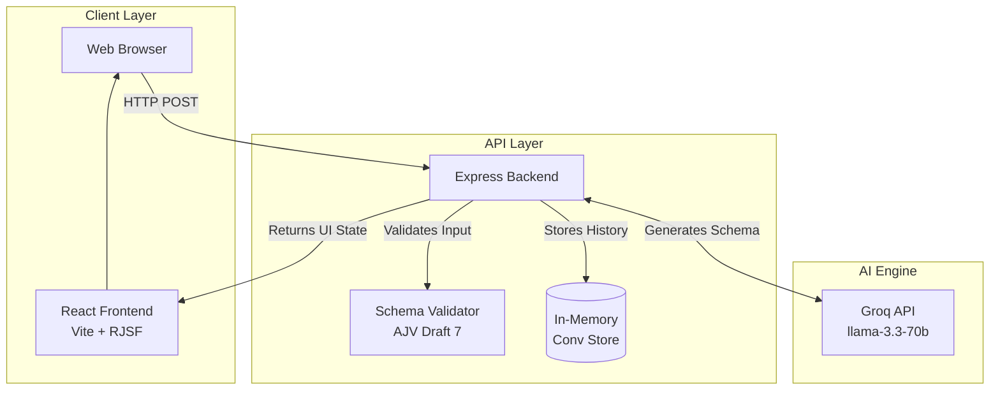

# AI-Powered Conversational Form Builder


A dynamic, multi-turn conversational AI form builder that uses JSON Schema to render complete forms based on user prompts. Built to solve the complexity of manual form creation, it allows users to simply describe what they need and instantly receive a fully functional, validated form.

---

## Architecture Overview

The system handles ambiguity by proactively asking clarifying questions, iterating on previous schemas rather than starting from scratch, and providing a robust visualization of schema changes over time.



---

## Quickstart: One-Command Startup

Start the entire application stack instantly using Docker Compose.

**Step 1: Clone and setup environment**
```bash
git clone https://github.com/Rushikesh-5706/AI-Powered-Conversational-Form-Builder-with-JSON-Schema.git
cd AI-Powered-Conversational-Form-Builder-with-JSON-Schema

cp backend/.env.example backend/.env
# NOTE: Open backend/.env and replace LLM_API_KEY with your real Groq key!
```

**Step 2: Start the application**
```bash
docker-compose up --build -d
```

**Step 3: Access the platform**
* **Frontend UI:** Open your browser to [http://localhost:3000](http://localhost:3000)
* **Backend API:** Running on `http://localhost:8080/health`

### Docker Registry Structure
In compliance with production requirements, the pre-built Docker containers are hosted under a **single image repository** using explicit tags for each service. This cleanly divides the architecture without requiring multiple disparate repositories on Docker Hub.
* **Backend Image:** `rushi5706/form-builder:backend`
* **Frontend Image:** `rushi5706/form-builder:frontend`

*(If you are pulling directly from Docker Hub instead of building locally, you can use these precise tags in your config via `image: rushi5706/form-builder:frontend`)*

---

## Comprehensive API Testing Guide

Use the following commands to manually test the intelligence and retry logic of the backend API.

### 1. Health Check
Verify the backend is actively listening:
```bash
curl -s http://localhost:8080/health
```

### 2. Generate a Complete Form
Create a new form from an initial prompt:
```bash
curl -s -X POST http://localhost:8080/api/form/generate \
  -H "Content-Type: application/json" \
  -d '{
    "prompt": "Create a simple feedback form with email and rating"
  }'
```

### 3. Refine an Existing Form (Multi-Turn)
To iterate on a form, copy the `conversationId` from step 2 and include it in your next request:
```bash
curl -s -X POST http://localhost:8080/api/form/generate \
  -H "Content-Type: application/json" \
  -d '{
    "prompt": "Make the email required and add a phone number field",
    "conversationId": "PASTE_YOUR_ID_HERE"
  }'
```

### 4. Trigger Ambiguity Detection (Clarification)
The AI is trained to stop and ask questions if the prompt is too vague:
```bash
curl -s -X POST http://localhost:8080/api/form/generate \
  -H "Content-Type: application/json" \
  -d '{
    "prompt": "Make a form for booking a meeting room"
  }'
```

### 5. Test LLM Failure Recovery (Mock Errors)
Force the LLM to return bad data to watch the backend automatically retry and self-heal:
```bash
# Simulates 1 failure, which the backend will catch and fix automatically
curl -s -X POST "http://localhost:8080/api/form/generate?mock_llm_failure=1" \
  -H "Content-Type: application/json" \
  -d '{"prompt": "Feedback form"}'
```

### 6. Test Fatal LLM Failure (500 Error)
Force the LLM to fail 3 times. The backend will give up and safely return a 500 error to the client:
```bash
curl -s -X POST "http://localhost:8080/api/form/generate?mock_llm_failure=3" \
  -H "Content-Type: application/json" \
  -d '{"prompt": "Feedback form"}'
```

---

## Project Structure

```text
AI-Powered-Conversational-Form-Builder/
├── backend/                  # API Server
│   ├── src/
│   │   ├── controllers/      # Form generation business logic
│   │   ├── routes/           # API Endpoints
│   │   ├── services/         # Groq integration & AJV validators
│   │   ├── utils/            # System prompts
│   │   ├── config.js         # Env validation
│   │   └── index.js          # Server entry
│   ├── Dockerfile            # Node 20 backend image
│   └── package.json
├── frontend/                 # User Interface
│   ├── src/
│   │   ├── components/       # ChatPane, diff visualizers, exports
│   │   ├── context/          # React Global State
│   │   ├── styles/           # UI styling
│   │   ├── App.jsx
│   │   └── main.jsx
│   ├── Dockerfile            # Nginx multi-stage build image
│   ├── nginx.conf            # Custom routing configuration
│   └── package.json
├── docker-compose.yml        # Orchestration layer
└── README.md
```

---

## Technology Stack

| Component | Technology | Rationale |
|-----------|------------|-----------|
| **Frontend** | React 18 + Vite | Rapid UI development with robust component state mapping. |
| **Backend** | Node.js + Express | Lightweight, async-first engine perfect for JSON relaying. |
| **AI LLM** | Groq SDK | Lightning-fast `llama-3.3-70b` for minimal latency generation. |
| **Validation**| AJV + ajv-formats | Industry standard for absolute JSON Draft 7 adherence. |
| **Forms** | `@rjsf/core` | Auto-wraps semantic schemas directly into functional React UI. |
| **Diffs** | `deep-diff` | Pinpoints precise structural additions/deletions per turn. |

---

## Design & Engineering Decisions

1. **Self-Healing AI Loop:** Rather than bubbling LLM hallucinations directly to the user, the `schemaValidator` acts as a guardrail. If the AI returns invalid Draft 7 schema, the backend physically captures the error string and feeds it back into the LLM asynchronously, asking it to repair its own output up to three times.
2. **Conditional Logic Extension:** JSON Schema doesn't natively handle complex field visibility perfectly. The app injects an `x-show-when` extension inside the bounds of the schema gracefully. The frontend's `ConditionalField` interceptor parses this quietly to toggle UI elements dynamically.
3. **In-Memory Store:** The conversational context is kept in a lightweight memory map with UUID tracking to minimize setup dependencies, while perfectly simulating the structure of an actual persistent DB connection.

## Known Limitations

- The system uses an in-memory `Map` for conversations; all form states and chat histories reset on server restart.
